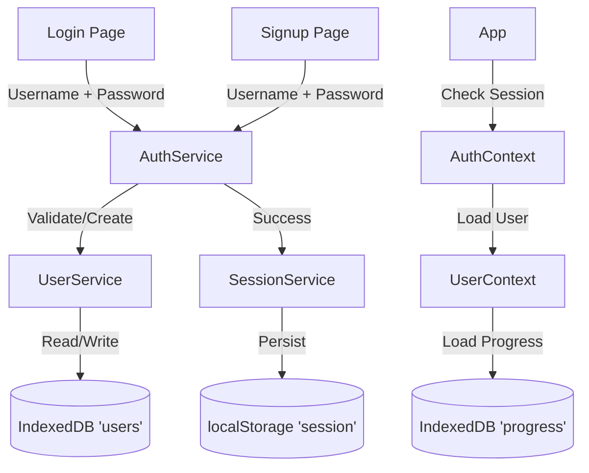

# Local Authentication Architecture

This document explains the local-only authentication system implemented in Mindful Architecture.

## Overview

The app uses a custom local authentication system that mimics a real backend auth provider (like Supabase) but runs entirely in the browser using:
- **IndexedDB** for storing user credentials and profile data
- **localStorage** for session management
- **Web Crypto API** for secure password hashing (SHA-256)

## Security Model

> [!WARNING]
> **This is a PROTOTYPE authentication system.**
> While it uses hashing and secure practices, it runs on the client side. A user with access to the browser's DevTools can potentially manipulate the logic. It is designed for **local prototyping only**.

| Component | Implementation | Security |
|-----------|----------------|----------|
| **Users** | IndexedDB `users` store | Hashed passwords, no plaintext |
| **Session** | localStorage `session` key | Tokenless (state only) |
| **Passwords** | SHA-256 with Salt | Hashed before storage |
| **Progress** | IndexedDB `progress` store | Linked to stable User ID |

## Architecture



## Data Models

### User (IndexedDB)
Stored in `mindful-architecture-db` (v2) -> `users` store.

```typescript
type LocalUser = {
  id: string;              // SHA-256 hash of "user:username"
  username: string;        // "johndoe"
  passwordHash: string;    // SHA-256 hash of "username:password"
  createdAt: number;       // Timestamp
};
```

### Session (localStorage)
Stored in `mindful_architecture_session`.

```typescript
type Session = {
  userId: string;
  username: string;
  loggedInAt: number;
  expiresAt: number;       // 30 days
};
```

## Setup & Migration

### Database Versioning
- **Version 1**: Progress store only.
- **Version 2**: Added `users` store.
- **Migration**: Automatic. Existing progress is preserved.

### Future Supabase Migration
The system is designed to be swapped for Supabase Auth with minimal friction:

1. **UserService** methods map directly to Supabase SDK methods:
   - `createUser` -> `supabase.auth.signUp`
   - `validateLogin` -> `supabase.auth.signInWithPassword`

2. **UserContext** uses `userId` as the primary key. When migrating:
   - Supabase `auth.user.id` (UUID) replaces the local SHA-256 `id`.
   - Progress loading logic remains the same (keyed by ID).

## Files Involved

| File | Purpose |
|------|---------|
| `src/services/userService.ts` | IndexedDB user management (SHA-256 hashing) |
| `src/services/sessionService.ts` | localStorage session management |
| `src/services/authService.ts` | Orchestrator (User + Session) |
| `context/AuthContext.tsx` | Global authentication state |
| `context/UserContext.tsx` | User progress loading (auth-aware) |
| `App.tsx` | Protected routes & AuthProvider injection |

## Testing

### Manual Verification
1. **Signup**: Create account `test` / `password123`.
2. **Persistence**: Refresh page -> Should stay logged in.
3. **Data Isolation**: Complete a task. Logout. Create new account `test2`. Progress should be empty.
4. **Relogin**: Logout. Login as `test`. Progress should be restored.

### Debugging
Run in console:
```javascript
// List all users
(await import('./src/services/userService').then(m => m.userService.listUsers()))

// Check session
localStorage.getItem('mindful_architecture_session')
```
